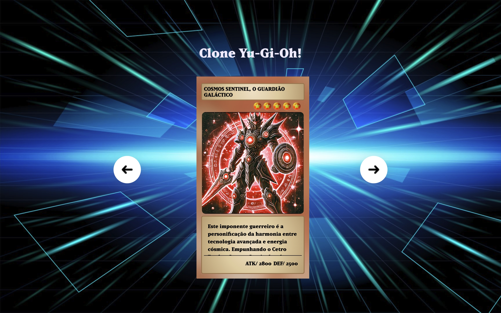

<h1 align="center">Zero to Hired Programmer Week - Yu-Gi-Oh! Clone</h1>

  This project was developed during the <strong>"Zero to Hired Programmer Week"</strong>, hosted by the twin duo from the <a href="https://www.youtube.com/@DevemDobro">Dev em Dobro</a> channel. The goal was to create a responsive layout inspired by <em>Yu-Gi-Oh!</em>, an iconic manga and anime series.

  <a href="#-technologies">Technologies</a>&nbsp;&nbsp;&nbsp;|&nbsp;&nbsp;&nbsp;
  <a href="#-project">Project</a>&nbsp;&nbsp;&nbsp;|&nbsp;&nbsp;&nbsp;
  <a href="#-credits">Credits</a>

 

  

## 🚀 Technologies
This project was built using the following technologies:
- **HTML, CSS, and JavaScript**
- **Git and GitHub**
- **Responsively App**

## 💻 Project
This website allows players to:
- Switch between different card views.
- Activate defense mode by rotating the card to a face-down position.

- [🔗 Access the finished project](https://andreskull2.github.io/clone-yu-gi-oh/)
- [💡 Check out Dev em Dobro!](https://www.instagram.com/devemdobro)

## 🙌 Credits
Made by **Dev em Dobro** :wave: [Join our community!](https://discord.com/channels/821364094878613524/822446282593271820)
